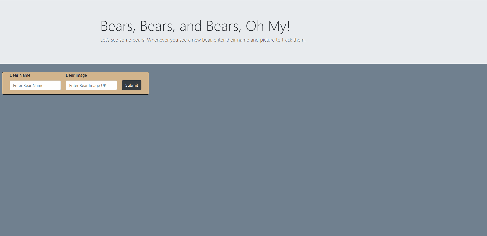

# Bear Watcher

This is a single-page application that lets users submit the name and image of a bear, then prints that information to a card on button click.

## Details

This application uses modules to compartmentalize the different javascript functions. One module prints the form to the DOM, and the other prints the bear cards to the DOM upon button click.

## Technologies Used

HTML, CSS, JavaScript, Bootstrap, JQuery

## Link

[Link to the application](https://bandstrar-bear-watcher.netlify.app/)